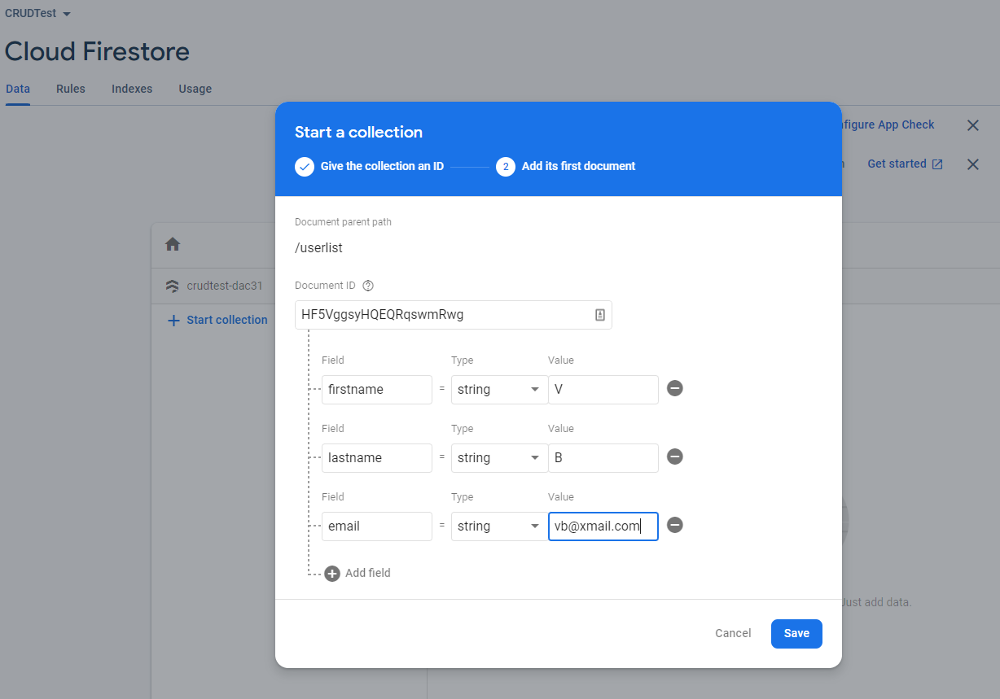
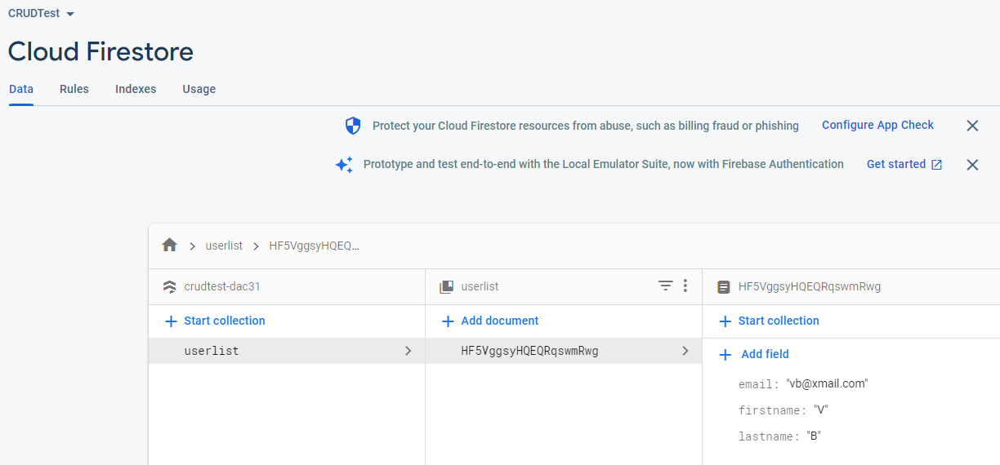
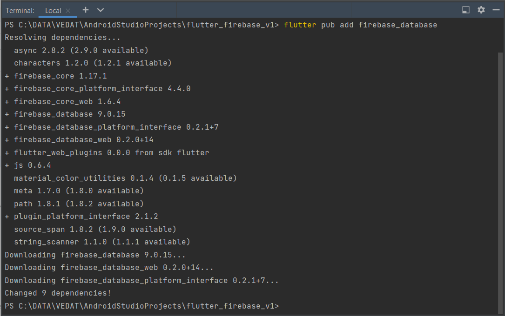

# flutter_firebase_v1

Burada Firebase ile deneme olarak kendimiz bir CRUD işlem oluşturalım.
Vedat Biner

CRUD Test Adında bir Firebase projemiz olsun.
Userlist adında bir collection aşağıdaki alanları içersin.

Görünümü

Firebase projemizin bulunduğu dizinde 
flutter pub add firebase_database ile yapalım.

Bu işlem ile pubspec.yaml dosyası içine   firebase_database: ^9.0.15 ekleniyor.

Android >> app içindeki build.gradle dosyasına aşağıdakileri ekleyelim.
minSdkVersion 25
targetSdkVersion 32

Android altındaki build.gradle dosyası altına

main.dart içine :
import 'package:firebase_database/firebase_database.dart'; 
ekleyelim.

FirebaseDatabase database = FirebaseDatabase.instance; ekleyelim  
 

Buradan devam : https://firebase.google.com/docs/database/flutter/start
